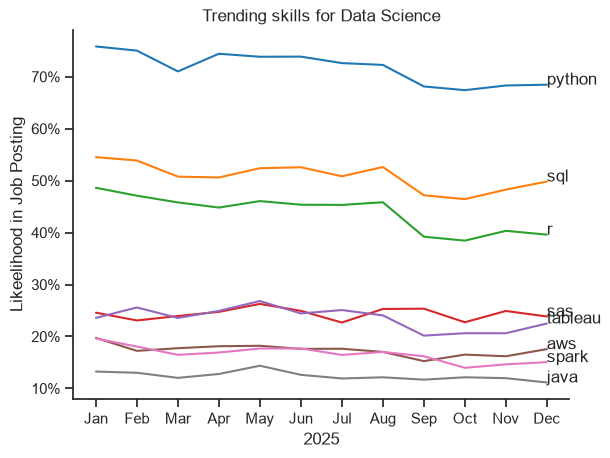
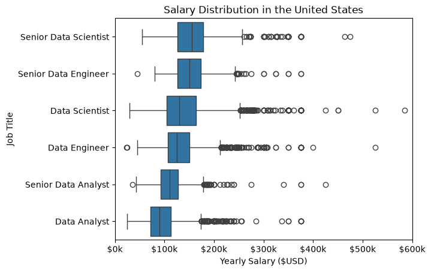
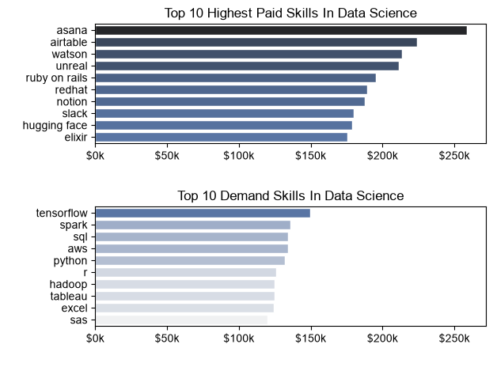
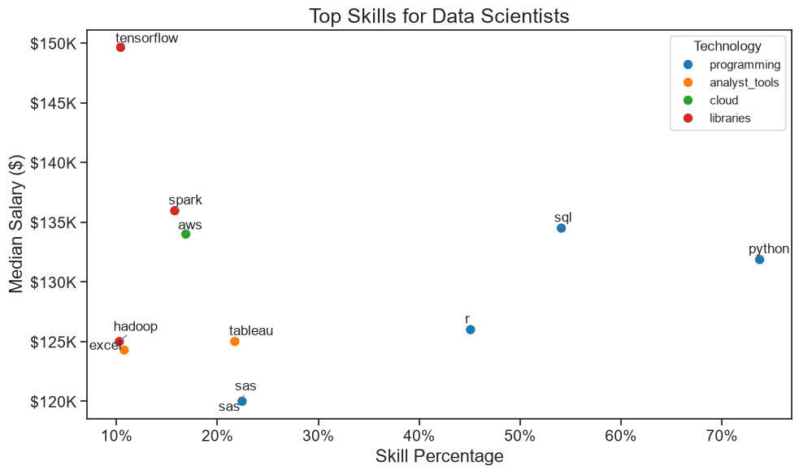

# Introduction

This project explores the data job market to answer a question I've been asking myself while coming into the data world: **which skills should I actually prioritize learning?** Using a real dataset of data job postings, I analyzed demand, salary, and trends across the top data roles (Data Analyst, Data Engineer, Data Scientist) to figure out which skills offer the best combination of pay and job availability — and used the findings to guide my own learning path.

# Background

This project was driven by five core questions:

1. What are the most demanded skills for the top 3 most popular data roles?
2. How are in-demand skills trending for Data Scientist?
3. How well do jobs and skills pay for Data Nerds?
4. What are the highest-paid and most in-demand skills for Data Scientist?
5. What is the most optimal skill to learn for Data Science?

### Data source
The data behind this analysis comes from [Luke Barousse's Data Jobs dataset](https://huggingface.co/datasets/lukebarousse/data_jobs), packed with job titles, salaries, locations, and skills for data-related postings.

# Tools Used

To dig into the data, I relied on:

- **Python** — the core of my analysis, allowing me to process data and find critical insights
  - **Pandas** — for cleaning, filtering, and analyzing the data
  - **Matplotlib** & **Seaborn** — for visualizing the results
- **Jupyter Notebooks** — to run Python scripts and mix in notes/analysis as I went
- **Visual Studio Code** — for writing and running my Python scripts
- **Git & GitHub** — for version control and sharing my code
- **Miniconda** — to manage my Python environment and packages

# The Analysis

## 1. Skills Demand

### What are the most demanded skills for the top 3 most popular data roles?

To find the most demanded skills for the top   3 most popular data roles. I filtered out those positions by which ones were the most popular, and got the top 5 skills for these top 3 roles. This query highlights the most popular job titles and their top skills, showing which skills I should pay attention to dependingon the role I am targeting.

### Visualize Data

    fig, axes = plt.subplots(len(job_titles), 1, figsize=(9, 3*len(job_titles)))

    for i, job in enumerate(job_titles):
        df_plot = df_skills_perc[df_skills_perc['job_title_short']==job].head(5)
        sns.barplot(data=df_plot, x='skill_percentage', y='job_skills', ax=axes[i])
        axes[i].set_title(job)
        if i < len(job_titles)-1:
            axes[i].set_xlabel('')

    fig.suptitle('Top Skills by Job Title')
    plt.tight_layout()
    plt.show()

### Result

*Bar Graph visualizing the necesssary skills for the major data roles*

### Insights 

- SQL is the most consistently demanded skill across all three roles, appearing in the top 5 for Data Analyst (50.8%), Data Engineer (68.3%), and Data Scientist (51.1%) — making it the most foundational, transferable skill in data careers.
- Python shows a clear progression by role: a supporting skill for analysts (27.1%), a core requirement for engineers (64.9%), and the single most in-demand skill for scientists (72.0%).
- Data Analyst roles favor accessible, business-facing tools like Excel (40.6%) and Tableau (28.5%), reflecting a reporting-focused role.
- Data Engineer roles combine SQL and Python with cloud/infrastructure skills (AWS, Azure) and Spark, pointing to a pipeline-and-infrastructure focus.
- Data Scientist roles show the highest single-skill demand overall (Python at 72.0%), with R also appearing — the only role where R shows up meaningfully — suggesting a stronger statistical/modeling emphasis

## 2. Skills Trend

### How are in demand skills trending for Data  Scienctist

To find the most demanded skills for data scientist, I filtered the positions by Data scientist, then got the top 8 skills for each of the role. This query highlights one of the most popular job titles and its top skills, showing which skills to focus on while choosing the data scientist role.

### Visualize Data

        sns.lineplot(data=df_plot, dashes=False, palette='tab10', legend=False)
        plt.title('Trending skills for Data Science')
        plt.xlabel('2025')
        plt.ylabel('Likeelihood in Job Posting')
        from matplotlib.ticker import PercentFormatter
        ax = plt.gca()
        ax.yaxis.set_major_formatter(PercentFormatter(xmax=100))
        for i, skill in enumerate(df_plot.columns[:8]):
            plt.text(len(df_plot) - 1, df_plot.iloc[-1, i], skill)
        plt.show()

### Results

*Bar graph visualizing the trending  top skills for data science in USA*

###  Insights 

- Python remains the most consistently in-demand skill throughout 2025, holding steady between 68-76%, though it shows a gradual decline from a peak in January to a lower, stable range from September onward.
- SQL sits firmly in second place all year (around 46-54%), staying relatively stable with only minor fluctuations — reinforcing it as a consistently essential skill alongside Python.
- R shows a clear downward trend, dropping from roughly 49% in January to around 39-40% by September through December — suggesting R's relative importance may be gradually declining compared to earlier in the year.
- SAS and Tableau are closely matched for most of the year (around 20-27%), with SAS showing a slight edge and more volatility, including a dip in September before recovering.
- AWS, Spark, and Java remain the least in-demand of the tracked skills, consistently under 20%, with Java the lowest throughout — pointing to these as lower-priority skills specifically for Data Scientist roles (likely more relevant for Data Engineer positions instead, based on your earlier chart).
- Overall, the ranking of skills stayed fairly stable across the year — no skill overtook another in the rankings — suggesting the core skill set for Data Scientists didn't shift dramatically month to month, even as individual percentages moved slightly.

## 3. Salary Analysis For Data  Nerds

### How well do jobs and skills pay for Data Nerds?

To find how well jobs and skills pay for Data Nerds, I looked at the salary distributions for the major datanerd roles and thier senior roles.

#### Visualization

    sns.boxplot( data=df_USA_top6, x='salary_year_avg', y='job_title_short', order= df_median, orient='h')
    plt.title('Salary Distribution in the United States')
    plt.xlabel('Yearly Salary ($USD)')
    plt.ylabel('Job Title')
    ax = plt.gca()
    ax.xaxis.set_major_formatter(plt.FuncFormatter(lambda x, pos: f'${int(x/1000)}k'))
    plt.xlim(0, 600000)
    plt.show()

#### Results

*Box plot visualizing the salary distributions for the top 6 data  job titles.*

### Insights

- Salary scales with seniority as expected: Senior roles consistently show higher median salaries than their non-senior counterparts — Senior Data Scientist and Senior Data Engineer both sit noticeably above Data Scientist and Data Engineer, and Senior Data Analyst outpaces Data Analyst.
- Data Scientist and Data Engineer roles command the highest pay overall, with median salaries in the $140k-$160k range, well above Data Analyst roles.
-Data Analyst has the lowest median salary of all six roles, sitting around $100k-$110k, confirming it as more of an entry-point role in the data career path.
- Senior Data Scientist shows the widest salary range and the most extreme high-end outliers, with some postings reaching $500k-$580k — suggesting this role has the highest ceiling for top-paying positions, likely at senior/staff/principal levels or specialized industries.
- All roles show significant right-skew (a long tail of high-paying outliers), meaning while median salaries cluster in a fairly tight band, a subset of postings in every role pays substantially above the norm — worth investigating what differentiates those outlier listings (company, industry, or specialization).
- Data Engineer and Data Scientist have very similar median salaries, suggesting comparable market value between the two roles despite differing skill sets, while Senior Data Engineer and Senior Data Scientist track closely as well.

## 4. Skills Salary

### What are the highest-paid and most in-demand skills for Data Scientist?

To find the highest-paid and most in-demand skills for Data Science, I looked at both the median salary for each skill and how often that skill appeared in job postings. This query highlights the difference between skills that pay the most and skills that are asked for the most, showing which skills to prioritize depending on whether the goal is higher pay or better job availability.

### Visualization

    sns.set_theme(style='ticks')
    sns.barplot(data=df_DS_top_pay, x='median', y=df_DS_top_pay.index, ax=ax[0], hue= 'median', palette='dark:b_r')
    #ax[0].invert_yaxis()
    ax[0].set_title('Top 10 Highest Paid Skills In Data Science')
    ax[0].xaxis.set_major_formatter(lambda x, pos: f'${int(x/1000)}k')
    sns.barplot(data=df_DS_skills, x='median', y=df_DS_skills.index, ax=ax[1],hue= 'median', palette='light:b')
    ax[1].set_xlim(ax[0].get_xlim())
    ax[1].set_title('Top 10 Demand Skills In Data Science')
    ax[1].xaxis.set_major_formatter(lambda x, pos: f'${int(x/1000)}k')

### Result

*Box plot visualizing the median salary versus demand count for the top skills in Data Science*

### Insights 

- The highest-paid skills (Asana, Airtable, Watson, Unreal, Ruby on Rails) are niche or specialized tools, with median salaries reaching $220k-$260k. but these rarely overlap with the most commonly requested skills.
- The most in-demand skills (TensorFlow, Spark, SQL, AWS, Python) top out around $130k-$150k in median salary, notably lower than the top-paying niche skills, despite being far more frequently requested.

## 5. Optimum Skills

### What is the most optimum skills to learn for Data Science?

To find the optimum skills to learn for Data Science, I looked examine both the median salary for each skill and how often that skill appeared in job postings. This query highlights the balance between skills that pay the most and skills that are most in-demand, showing which skills offer the best combination of high pay and strong job availability for someone learning Data Science.

### Visualization

    plt.figure(figsize=(10, 6))
    ax = sns.scatterplot(
        data=df_DS_skills_tech_high_demand,
        x='skill_percent',
        y='median_salary',
        hue='technology',
        palette='tab10',
        s=80
    )
    Label each point with the skill name
        texts = []
        for _, row in df_DS_skills_tech_high_demand.iterrows():
            texts.append(
                plt.text(
                    row['skill_percent'],
                    row['median_salary'],
                    row['skill'],
                    fontsize=12,
                    ha='right',
                    va='bottom'
                )
            )

        adjust_text(texts, arrowprops=dict(arrowstyle='->', color='gray', lw=1))

        ax.set_title('Top Skills for Data Scientists', fontsize=18)
        ax.set_xlabel('Skill Percentage', fontsize=16)
        ax.set_ylabel('Median Salary ($)', fontsize=16)

### Result

*A scatter plot visualizing the most optimal skills (high paying & high  demand) for data scientist*

###  Insights 

- SQL and Python stand out as the clear optimal choices, combining high demand (over 50% and 70% of postings respectively) with solid median salaries ($130k-$135k) — confirming these as the highest-value skills to prioritize, matching the "programming" category's strong overall position.
- TensorFlow is the highest-paying skill on the chart ($150k median) but has very low demand (around 10%), making it a high-reward, niche specialization rather than a foundational skill — useful to add after building core skills, not before.
- Spark and AWS offer a strong middle ground, with above-average salaries ($134k-$136k) at moderate demand (~15-17%), suggesting they're solid "next-step" skills once the fundamentals are covered.
- R sits in an interesting position — moderate demand (~45%) but the lowest salary among the programming-category skills ($126k), suggesting it's still relevant but less financially rewarding than SQL or Python for this role.
- Analyst tools (Excel, Tableau, Hadoop) and SAS cluster in the lower-left, with both low demand and the lowest salaries on the chart (~$120k-$125k) — indicating these are lower-priority skills specifically for the Data Scientist role (though they may matter more for Data Analyst positions, as seen in earlier charts).
- Overall pattern: the "programming" category (blue) dominates the upper-right (high demand, solid pay), while "analyst_tools" (orange) clusters in the lower-left (low demand, lower pay) — reinforcing that programming skills are the core value driver for Data Scientist roles, with cloud/library skills (Spark, AWS, TensorFlow) as high-value specializations layered on top.

# What I Learned

Working through this project pushed my skills forward in a few concrete ways:

- **Data wrangling in pandas** — filtering, exploding list-columns, pivot tables, and grouping/aggregating became second nature by the end.
- **Visualization storytelling** — moving beyond just plotting data to actually labeling, formatting, and titling charts so they communicate a clear insight at a glance.
- **Version control as a habit** — using Git/GitHub properly (commits, pushes, `.gitignore` for large files) rather than manually saving file copies.
- **Debugging real errors** — chasing down typos, wrong data types, and mismatched column names taught me to read tracebacks methodically instead of guessing.

# Insights

Pulling the five analyses together:

- **SQL and Python are the two non-negotiable skills** across every data role and every angle of this analysis — highest in demand, consistently well-paid, and foundational regardless of specialization.
- **Skill value depends heavily on role**: Data Analyst leans on Excel/Tableau, Data Engineer leans on cloud/infrastructure tools (AWS, Azure, Spark), and Data Scientist leans on Python and R for modeling.
- **Pay and demand don't always align** — niche tools (TensorFlow, Asana, Airtable) can pay a premium, but core skills (SQL, Python) offer the best balance of high demand and strong pay, making them the safest place to invest early.
- **Seniority significantly increases salary** across every role, with Senior Data Scientist showing both the highest ceiling and widest salary range.
- **Skill demand stayed relatively stable across 2025** — no major reshuffling in rankings month to month, suggesting the core skill set for these roles isn't shifting dramatically in the short term.

# Conclusion

This project confirmed what I suspected going in but gave me actual data to back it up: **SQL and Python are the foundation, and everything else is a specialization layered on top.** For my own path — moving from biochemistry into healthcare-adjacent data roles — this means doubling down on SQL and Python fundamentals now, while keeping an eye on tools like Tableau (for reporting) and cloud platforms (for future growth), rather than spreading myself thin across every tool on the market. This project itself, from a messy Anaconda install to a working end-to-end analysis pushed to GitHub, has been as much a lesson in the *process* of data work as it has been in the findings themselves.

